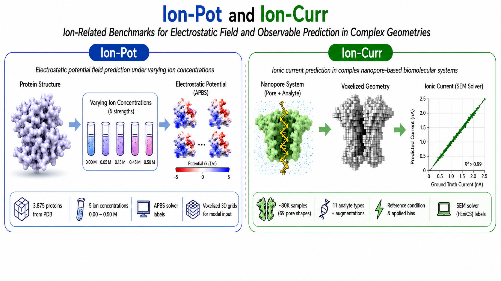

# Ion-Pot and Ion-Curr

This repository contains code, models, and resources for **Ion-Pot** and **Ion-Curr**, two benchmark tasks for electrostatic field prediction and observable prediction in complex biomolecular geometries.

## Overview

* **Ion-Pot**: electrostatic potential field prediction around biomolecules under varying ionic conditions.
* **Ion-Curr**: ionic current prediction for nanopore-based biomolecular systems.

<p align="center">
  
</p>

## Repository Structure

Each subfolder contains its own README with task-specific instructions, including data preparation, model training, and evaluation details.

## Citation

If you use this repository, please cite our paper:

```bibtex
@inproceedings{
liu2026ionpot,
title={Ion-Pot and Ion-Curr: Ion-Aware Benchmarks for Electrostatic Field and Observable Prediction in Complex Geometries},
author={Jingqian Liu and Pinhao Gu and Aleksei Aksimentiev},
booktitle={ICML 2026 Workshop on AI for Physics},
year={2026},
url={https://openreview.net/forum?id=wuJjHvzTwC}
}
```
